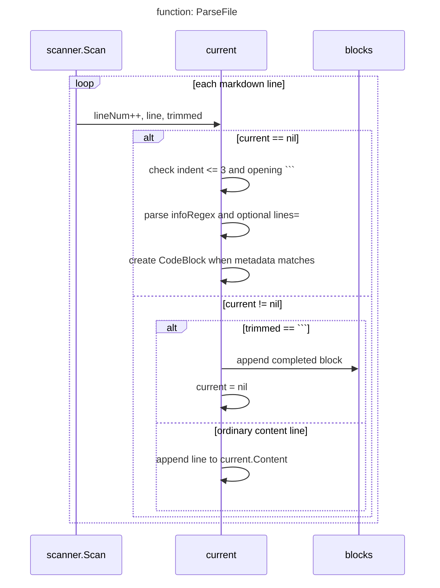

# Markdown Parsing

[Back to Overview](overview.md) | Next: [Tree-sitter Classification](tree-sitter.md)

The markdown parser's job is to extract fenced code blocks that reference source
files. Ordinary code blocks (those without `file=`) are ignored entirely — they
might be illustrative examples or pseudocode.

## The code block reference syntax

A code block references source code by adding `file=` to the fenced code
block's info string. `lines=` is optional:

    ```go file=path/to/file.go lines=10-25
    // exact copy of those lines
    ```

When `lines=` is present, it can be a single line (`lines=5`) or a range
(`lines=10-25`). Both endpoints are inclusive and 1-based.

Without `lines=`, `litcode` matches the block by content. Mermaid fences can also
reference a file and describe a function or method structurally rather than
embedding its source verbatim.

## Package and imports

The parser lives in the `markdown` package and uses standard library packages
for file I/O, regular expressions, and string manipulation:

```go file=internal/markdown/parser.go
package markdown

import (
	"bufio"
	"os"
	"regexp"
	"strconv"
	"strings"
)
```

## The CodeBlock type

Each parsed block is represented as a `CodeBlock` struct that captures both the
reference metadata and the block's content:

```go file=internal/markdown/parser.go
type CodeBlock struct {
	Language  string
	File      string   // referenced source file path (relative to root)
	StartLine int      // start line in source file (1-based, inclusive)
	EndLine   int      // end line in source file (1-based, inclusive)
	Content   []string // lines of content in the code block
	DocFile   string   // which .md file this block is in
	DocLine   int      // line number in the .md file where the fence opens
}
```

The `DocFile` and `DocLine` fields are used for error reporting — when a block
has a content mismatch, the error message points back to the exact location in
the markdown file.

## Parsing the info string

The info string is parsed with a regular expression that extracts the language,
file path, and optional line range:

```go file=internal/markdown/parser.go
var infoRegex = regexp.MustCompile(`^(\w+)\s+file=(\S+)(?:\s+lines=(\d+)(?:-(\d+))?)?$`)
```

This matches strings like `go file=cmd/root.go lines=7-11` and captures:
- Group 1: the language (`go`)
- Group 2: the file path (`cmd/root.go`)
- Group 3: the start line (`7`)
- Group 4 (optional): the end line (`11`)

## The ParseFile function

`ParseFile` is a simple line-by-line state machine. It scans through the
markdown file looking for opening fences, then collects content lines until
it hits a closing fence:

```go file=internal/markdown/parser.go
func ParseFile(path string) (_ []CodeBlock, err error) {
	f, err := os.Open(path)
	if err != nil {
		return nil, err
	}
```

We set up a scanner and track the current line number. The `current` pointer
is nil when we're outside a code block:

```go file=internal/markdown/parser.go
	var blocks []CodeBlock
	scanner := bufio.NewScanner(f)
	lineNum := 0

	var current *CodeBlock
```

The main scanning loop has two states. When `current` is nil, we look for
an opening fence whose info string matches our regex. Per the CommonMark spec,
fenced code blocks may be indented 0-3 spaces — lines indented 4+ are
indented code blocks and are ignored. When the info string matches, we create
a new `CodeBlock` and start collecting. The overall control flow is clearer as
a state transition than as a long verbatim snippet:



Finally, we return the collected blocks and any scanner error:

```go file=internal/markdown/parser.go
	return blocks, scanner.Err()
```

Continue to [Tree-sitter Classification](tree-sitter.md) to see how source
lines are classified as skippable or requiring coverage.
