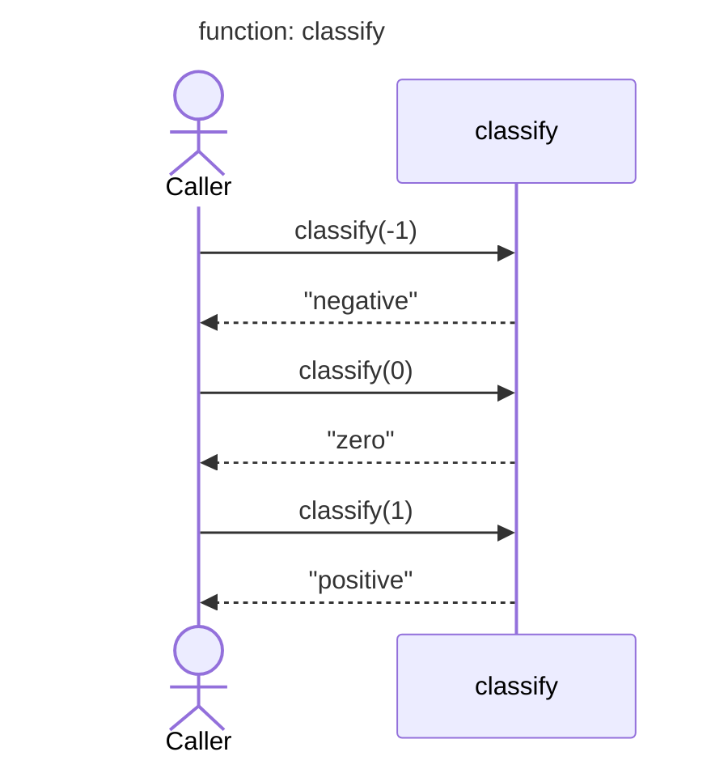

# Method Structure

```mermaid file=src/example.go
sequenceDiagram
    title function: classify
    actor Caller
    participant Classify as classify

    Caller->>Classify: classify(-1)
    Classify-->>Caller: "negative"
    Caller->>Classify: classify(0)
    Classify-->>Caller: "zero"
    Caller->>Classify: classify(1)
    Classify-->>Caller: "positive"
```
